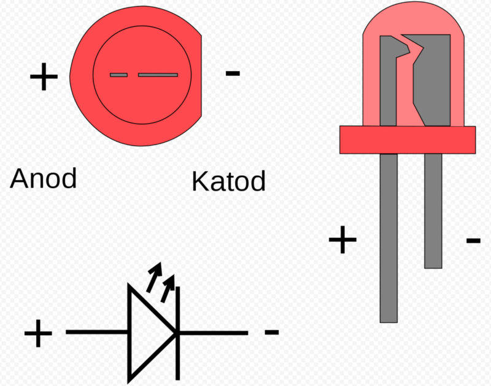

Rust 嵌入式开发

这是一个 Rust 嵌入式开发的示例项目，旨在展示如何使用 Rust 进行嵌入式系统编程。

## 工具
- [Rust](https://www.rust-lang.org/): Rust 编程语言。

## 参考
- [《ESP32 团队写的 Rust SDK 开发参考文档》](https://esp32.implrust.com/index.html)
- [《The Rust on ESP Book 简体中文版》](https://narukara.github.io/rust-on-esp-book-zh-cn/introduction.html)

使用芯片：ESP32-C3，[ESP32C3-CORE 开发板](https://wiki.luatos.com/chips/esp32c3/board.html)

## 项目示例
### no_std 环境
- `hello-world`：最简单的 Rust 嵌入式程序，输出 "Hello, world!"。
- `active-buzzer`: 控制蜂鸣器。
- `led-pwm`：使用 PWM 控制 LED 呼吸灯效果。
- `blinky-embassy`：控制 LED 闪烁效果。
- `button`：使用按钮控制 LED 闪烁效果。(循环检测)
- `button-interrupt`：使用按钮中断控制 LED 闪烁效果。（中断触发）
- `http-client`：使用 HTTP 客户端发送请求。
- `oled-spi`：使用 SPI 接口驱动 OLED 屏幕。

### std 环境

## 使用到的电子元件
### 面包板

### LED

### 四角按钮

### OLED 屏幕

与 ESP32-C3 开发板连接
|SSD1306 引脚|ESP32-C3 引脚|引脚编号|引脚功能|
|:-:|:-:|:-:|:-:|
|SCL/SCK|GPIO2|19|SPI2 时钟 (Clock)|
|SDA/MOSI|GPIO3|20|SPI2 主机输出从机输入 (Data)|
|DC|GPIO8|29|数据/命令选择 (Data/Command)|
|RST|GPIO4|28|复位|
CS	GPIO7	23	片选 (Chip Select)
